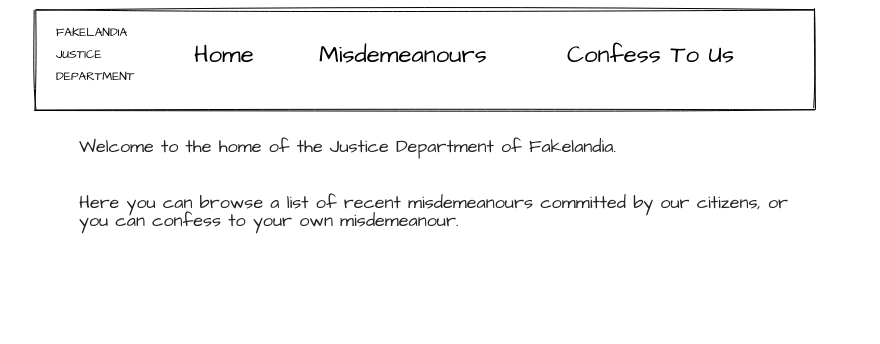

# Activity 1 - Site Structure

## Introduction - Dummy Routing

Part of this task is about practicing translating a visual design into an actual website.

Take a look at this image the goverment of Fakelandia have provided:

It looks like you'll want multiple **routes**. One for your homepage, and perhaps one each for the "misdemeanours" and "confession" pages?

👉 Use `npm` to install react-router version 6

👉 Get rid of the default bits of create-react-app that you don't need (e.g. `logo.svg`)

👉 Create dummy components for your home, confession and misdemeanour pages, e.g. 

`const Home = () => 
Home!
;`

👉 Add react-router components and define routes which render the right dummy components when you navigate to the URLs for your homepage, and a misdemeanours page, and a confession page.

(You will have to choose these URLs when you define your routes!)

## Layouts

From the image we've seen so far, it seems like the Fakelandians want a header with a nav bar in it to be shared across all their pages.

👉 Create a Layout component with a header in it. (Maybe the header would have its own sub-components such as Nav? Up to you!)

👉 Use nested routes to render the nav bar at the top of each of the routes you have so far.

(Remember to modify your `path` on your old routes - if you give the Layout a path of `'/'` then you need to remove that character from the start of the old routes.)

👉 Make sure your nav links are using the react-router components to navigate seamlessly between your routes.

👉 (Optional) It might be cool to add a footer! Although... footers are famously annoying to create using CSS, particularly if you want them to stay at the bottom for any height of page, so consider this a stretch goal. 

Multiple solutions exist. The most modern is to use flexbox - think about making your `<body>` flex in a column direction, and to make your `<main>` element flex-grow.

## Next

👉 Remember to **commit** your code often. Small commits with descriptive messages are best, e.g.:

* "Initial commit"
* "Installed react-router"
* "Added route component"

So far we've set up the basics of a functioning website! Let's get looking at that misdemeanours page in [activity 2](./activity_2.md)