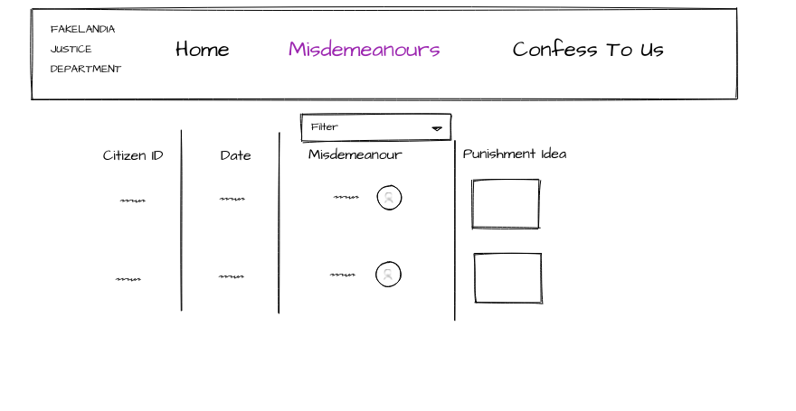

# Activity 2 - Crime & Punishment

## Misdemeanours Page

Let's see what the design is for this page:



Whoa! There's a LOT going on there.

Let's break it down.

## Requirements

The Fakelandians want a browsable list of all misdemeanours. You can decide how to display it - is it a table? A CSS grid? Built from flexbox? All are good options.

There are four columns to show. First, the citizen ID of the person committing the misdemeanour. (Rest assured they keep their data carefully anonymised so these IDs can't be traced back to individuals!)

Then, the date.

Then, the misdemeanour, which they insist is always shown next to an appropriate emoji:

- Mild Public Rudeness = 🤪
- Speaking in a Lift = 🗣
- Not Eating Your Vegetables = 🥗
- Supporting Manchester United = 😈

Lastly, the "Punishment Idea". Under the Fakelandian system all punishments are random. They find a random picture on the internet and use it as inspiration for the appropriate punishment. Due to the low number of crimes, this weird system supposedly works extremely well.

## Let's build it!

First, notice the highlight on the Misdemeanours link on the navbar. That looks like a good idea - we should highlight the NavLink for the page we're on!

According to the [React Router docs](https://reactrouter.com/docs/en/v6/api#navlink):

By default, an `active` class is added to a `<NavLink>` component when it is active.

👉 Add some CSS rules to style the links when the `active` class is added.

(Optionally you can use the following, more complicated, setup to pass a `styleObject` e.g. `{{ color: red}}`)

```TSX
        <NavLink
            to="someRoute"
            style={({ isActive }) =>
              isActive ? someActiveStyleObject : someOtherStyleObject
            }
          >
```

## Getting Misdemeanours

To get some misdemeanour data, we have to make a call to the server. We've already seen the API call to get misdemeanours:

👉 `http://localhost:8080/api/misdemeanours/:AMOUNT` where `:AMOUNT` is a number

## Typing Misdemeanours

👀 You may have noticed some handy custom types which the Fakelandians are using in their server, in `misdemeanours.types.ts`

😭 Unfortunately, if you try to import from this file in your React app, you'll get an error!

This is because React is configured to disallow imports outside of its working folder, which in this case means anything outside of `./client`

Trying to get around this leads down some deep rabbit holes 🐇 In the real world, we might use the following solutions:

- Move the custom type to a `shared` folder and perform some configuration wizardry to make imports possible 🧙
- Use dedicated tools for sharing code between multiple projects. Keeping multiple projects together in one repository is known as a `monorepo` and there are some powerful tools for this in modern JS development.

However, either of these configurations are overkill for this little project.

We can knowingly break the rule of Don't Repeat Yourself, but with the knowledge that we could figure out a way to share this type between client and server if we really wanted.

👉 Copy the `misdeameanour.types.ts` file into a new `types` folder in your `client` folder. Now you can import it and use it in your React project!

(The disadvantage is that if you edit this type for any reason you'll have to edit it in both places. But you likely won't have to edit it at all.)

## Putting it together: Fetching Misdemeanours

👉 Use `fetch` in your application to get misdemeanour data from the server, with the constraint that you ONLY want to fetch new data when you hit `F5` or otherwise fully refresh the page.

👉 Make this state accessible via `useContext` so you can consume it in sub-components you will write next

❗ The `fetch` function is asynchronous so be sure to `await` the results.

❗ The response from a `fetch` has an async convenience method called `.json`. You can `await` the result of this to get the JSON body of the response.

❗ Think about where your `fetch` should live. Can you abstract the `fetch` code outside of your components? Which component should "own" this data?

👉 Add sub-components to the Misdemeanours page to render all of the misdemeanours in a list

👉 Add a dropdown to the Misdemeanours column that filters the visible list to just one of the four misdemeanours.

❗ This filter shouldn't update the list stored in state - only the list being rendered on this page, so you might need to separate out those two concepts somehow. Passing a filtered list to the display list from the component which "owns" the misdemeanour data should do it!

## Punishment Ideas

The Fakelandian system for getting random punishment inspiration is to use a service called `Picsum`, which can be accessed simply by putting a particular URL into an image tag:

```HTML
;
```

👉 Use the Picsum service to add random pictures to each misdemeanour, setting `width` and `height` in the URL.

👉 Remember to **commit** your code often!

Now let's move on to [activity 3](./activity_3.md) where we'll help people confess to some misdemeanours.
