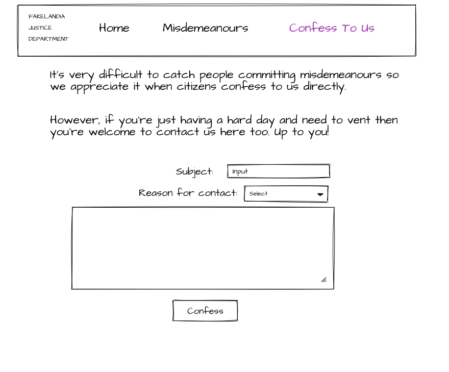

# Activity 3 - 

## Confession Page

Here's the design for this page:

Well, that's pretty surprising.

## Form Elements

It looks like they want a form with three elements. 

* A subject line for the confession.

* A dropdown for the reason for the confession. This could be either a type of misdemeanour, or "I just want to talk"

* A text box for details

## Form Behaviour

**When the form is filled in, the confess button becomes enabled.**

What does "filled in" mean, exactly? It's up to you! Perhaps the subject line is required, and the details must be a certain length, and a dropdown option must be selected? Or maybe you think other requirements make more sense - choose some sensible form states that will enable or disable the Confess button!

**When Confess is pressed, if they are confessing to a crime then it should be added to the list of crimes in the current application state. If they just want to talk, you can log their request in the console.**

👉 Build a form that obeys the above rules, with your own interpretation of what it means for the form to be correctly filled in.

👉 This might be a good candidate for some testing. (If you haven't been testing all your components already!) Add a `test.js` file to check your button is enabled/disabled correctly given the right props to the form component.

👉 Check you can submit your own crimes that get added to the list in state!

👉 (Optional) You may have noticed the 1.5s wait when you call `generateMisdemeanours`. If not, try increasing the sleep(1500) in `generateMisdemeanours` until it becomes annoying when you reload. Can you show a nice "loading" message while the fake API is loading?

(Hint: One way to do this could be to add an `isLoading` boolean to state, for example.)

## Hooray!

You've done it! You've modernised the extremely weird justice system of Fakelandia, and hopefully had some fun and got to experiment a little in the process.

Have a well-deserved rest and look forward to using all these skills to make some extremely cool apps!